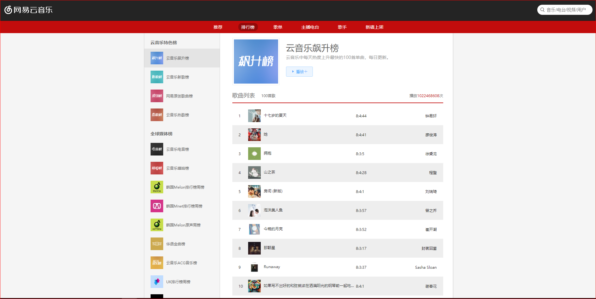

# 网易云音乐 vue版

> A Vue.js project

## Build Setup

``` bash
# install dependencies
npm install

# serve with hot reload at localhost:8080
npm run dev

# build for production with minification
npm run build

# build for production and view the bundle analyzer report
npm run build --report

# run unit tests
npm run unit

# run e2e tests
npm run e2e

# run all tests
npm test
```

For a detailed explanation on how things work, check out the [guide](http://vuejs-templates.github.io/webpack/) and [docs for vue-loader](http://vuejs.github.io/vue-loader).
## API

> 特别感谢 Binaryify 

> https://binaryify.github.io/NeteaseCloudMusicApi/#/

> 调用Binaryify的网易云音乐API，更改端口之后，在此项目中config.js中配置

## 技术栈

* Vue2：采用最新Vue2的语法
* Vuex：管理公共组件状态量
* vue-router：管理单页面应用路由
* axios：发起http请求
* sass：css预处理语言
* Webpack：自动化构建工具，主要配置vue-cli脚手架提供
* ES6：采用ES6语法

## 效果图




## 功能特性

* 热门推荐（歌单、mv、新碟）
* 排行榜
* 歌单（最新、热门）
* 主播电台
* 歌手、歌手详情
* 新碟上架、碟片详情
* 歌曲、歌曲详情
* 视频、视频详情
* 搜索
